<div align="center">


# WaaS

Waitlist-as-a-Service: A Live Queue You Can Watch Move


*A multi-tenant waitlist backend that any business can plug into: live positions pushed over WebSocket, a fixed number of serving slots with checkout countdowns, referral bumps, group joining and per-business isolation. Built with Spring Boot, Redis and Postgres, with a dashboard that shows every one of those moving parts on a real queue instead of just describing them here.*

[**Why this project**](#why-this-project) •
[**What's built**](#whats-built) •
[**Screenshots**](#screenshots) •
[**How it works**](#how-it-works) •
[**Numbers**](#numbers) •
[**Honest findings**](#honest-findings) •
[**What's still missing**](#whats-still-missing) •
[**Running it locally**](#running-it-locally)

<br />

---

</div>

## Why this project

A waitlist looks like a list with a counter. It stops being simple the moment it's real:

- A sneaker drop has 1 checkout slot and 5,000 people who all press "join" in the same second. Two of them must never get the same slot.
- People want to see their place in line change live, not refresh a page.
- If someone gets their turn and walks away, the slot has to go to the next person on its own.
- Referral programs let people jump ahead, which reorders the line while others are reading it.
- Groups of friends want to be served together, or at least not split up badly.
- The service is shared by many businesses, and none of them should see each other's data.

I wanted a project where every one of those problems is solved in code, tested under concurrency, and visible in a UI you can click through. The full design reasoning (including the parts I got wrong at first) is in [ARCHITECTURE.md](ARCHITECTURE.md).

## What's built

**Queue**
- Every waitlist is a Redis sorted set. Position is `ZRANK`, so reading it is O(log N) no matter how long the line is.
- Joins are written to Postgres first (`INSERT ... RETURNING join_sequence`), then added to Redis. If the Redis write fails, the durable row still exists and a reconciler puts it back.
- Joins accept an `Idempotency-Key`, so a retried request returns the first answer instead of joining twice.

**Serving slots and reservations**
- Each waitlist has N serving slots. The front of the line is moved into free slots by one Lua script (`promote.lua`), so the check and the move happen atomically on the Redis server.
- A reserved person gets a checkout window (say 10 minutes). They confirm, release, or run out of time. A sweeper expires lapsed slots every second and promotes the next person.
- State machine: `WAITING → RESERVED → CONFIRMED / EXPIRED`, plus `CANCELLED`. Postgres constraints make impossible states unrepresentable.

**Referrals**
- Joining through someone's link moves the referrer up by the waitlist's bump amount (rank-based, done in `bump.lua`).
- Credits that can't be used yet (you can't go past #1) are banked and applied if that person joins again.
- A velocity limit per referrer stops abuse. Blocked referrals are still recorded, so there's an audit trail.

**Groups**
- `PARTIAL`: friends who join together each get their own place.
- `STRICT`: the group holds one place and one slot, and every member has to confirm.

**Businesses (tenants)**
- Each business has an API key. It can only list, create and configure its own waitlists. A key from another business gets 404 on an admin call, not 403, so you can't even probe whether a waitlist exists.
- The directory endpoint pages and searches a business's waitlists, with live counts from Redis fetched in one pipelined round trip per page.

**Live updates**
- A separate WebSocket gateway (STOMP) holds the connections. Core publishes events to Redis pub/sub, and the gateway recomputes positions for its own subscribers at most once every 500 ms, so a burst of joins inside the same half second becomes one push per client, not one per join.
- On subscribe, the client gets the current state in one reply, which also covers reconnects without any event replay.

**Admission**
- JWT auth (guest, register, login), a rate limit of 20 writes per 10 s per user, and idempotency keys on POSTs.

**Dashboard**
- React, TypeScript and Motion. Two pages in one app: the list of waitlists, and one waitlist's live queue. Opening a waitlist flies its name from the list row into the page title.
- A small "shop" page (`frontend/public/shop.html`) shows how a business would plug the service into its own site, in one HTML file with no libraries.

**Proof**
- 51 integration tests running against real Postgres and Redis (Testcontainers), a concurrency test that shows the naive approach over-booking, a k6 load test, and GitHub Actions CI that runs the tests and builds every image on each push.

## Screenshots

All screenshots are from the running app. The theme follows the OS setting.

### The directory: a business's waitlists

The landing page lists the waitlists owned by the business whose API key is in the corner. Each row shows its live waiting count and how many slots are in use (the ochre dot means someone is being served right now). Search, paging and "new waitlist" all go through the per-business API.

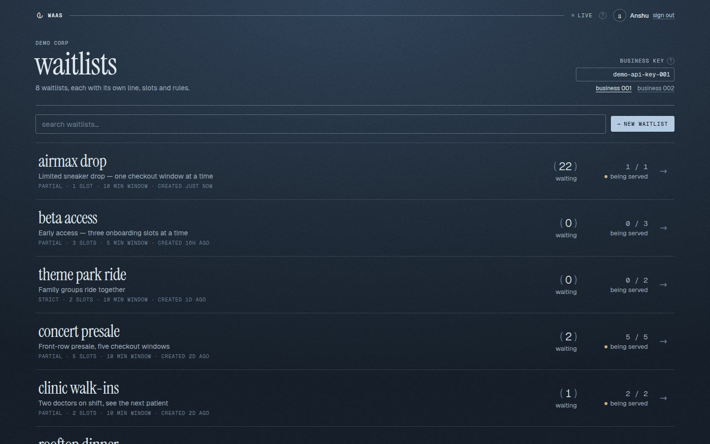

Switching the key to `demo-api-key-002` turns you into a different business (Nimbus Games). Its list has nothing in common with the first one, which is the tenant isolation doing its job.

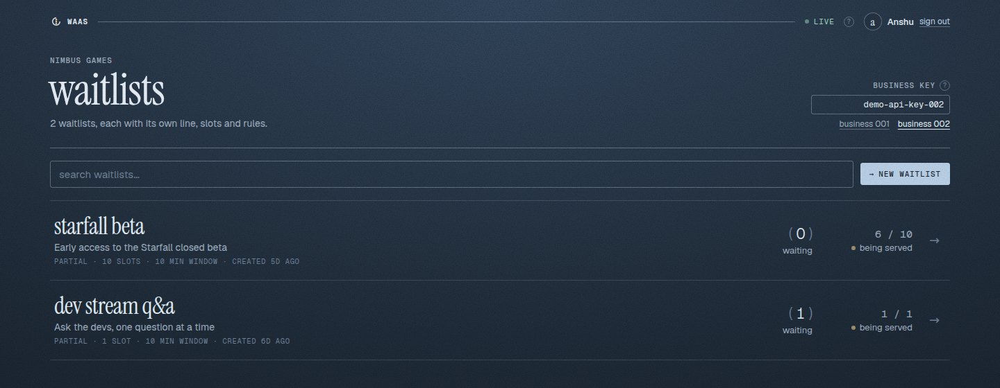

Creating a waitlist takes a name, the number of serving slots, the checkout window, the referral bump and the group policy. It opens straight onto the new waitlist's page.

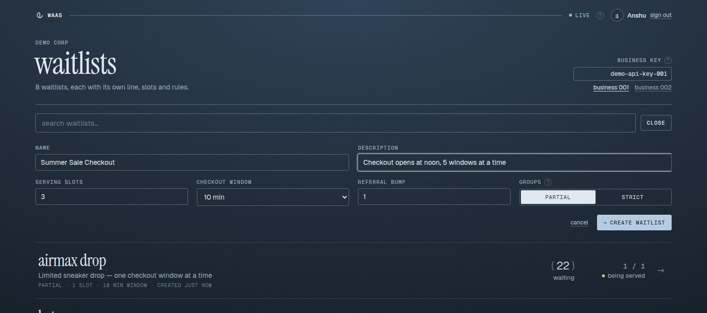

### One waitlist, live

The waitlist page. Frank holds the only slot on this drop, and the ring counts down his checkout window. Below him is the line: `NEXT` marks who gets the next free slot, `YOU` and `YOURS` mark people this browser joined, and the referrals column shows who jumped ahead (Alice gained 4 places from 3 friends). Est. wait is a worst case until enough people have finished their turn to measure how fast the line really moves.

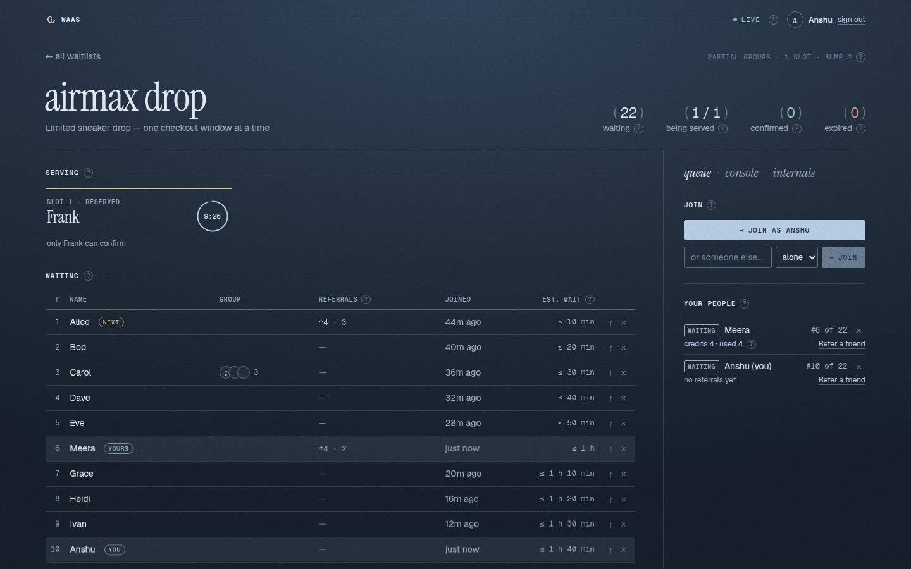

Almost every label has a `(?)` that explains it in plain words on hover.

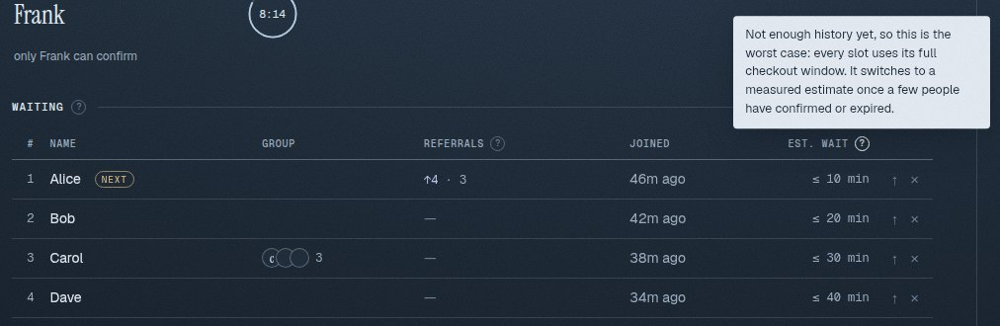

### Console and internals

The side panel has three modes. **Console** is for the business: simulate load (every click makes real API calls), trigger the rate limiter with 30 requests at once, change slots or the checkout window live, and copy an integration snippet with this waitlist's real id filled in.

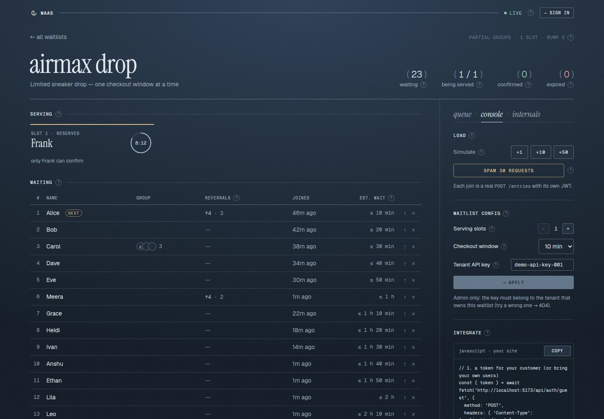

**Internals** is for the engineer: the Redis sorted-set score and entry id for every row, the referral audit trail, service health, and the gateway's fan-out counters (pushes out stay well below events in, because updates are batched).

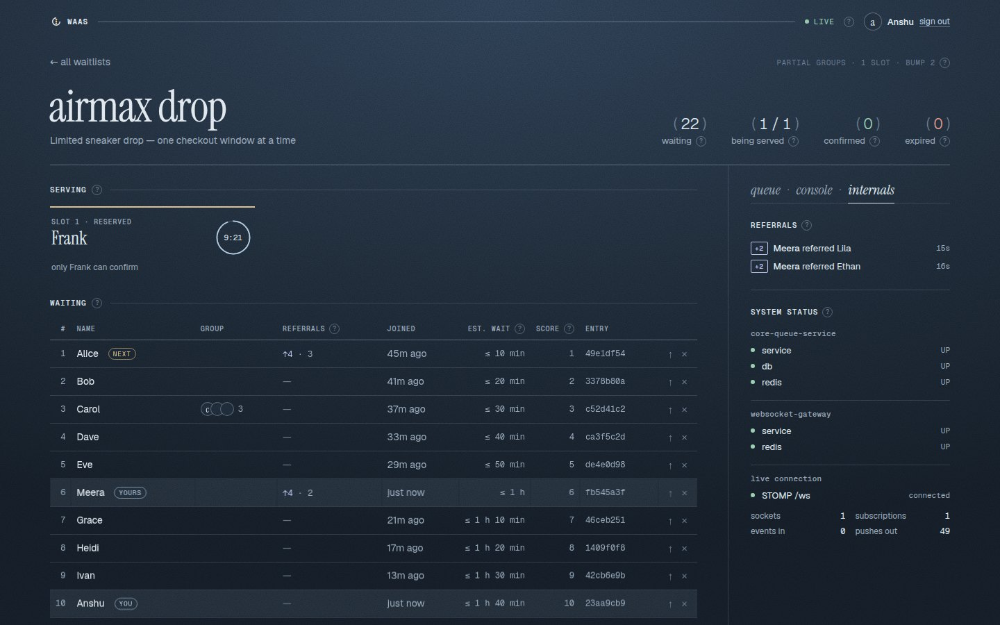

### Light theme and mobile

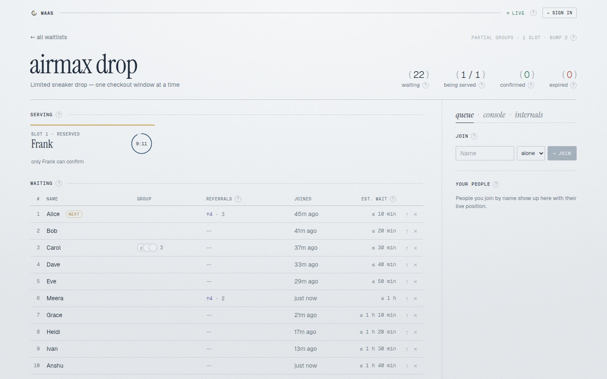

<p align="center">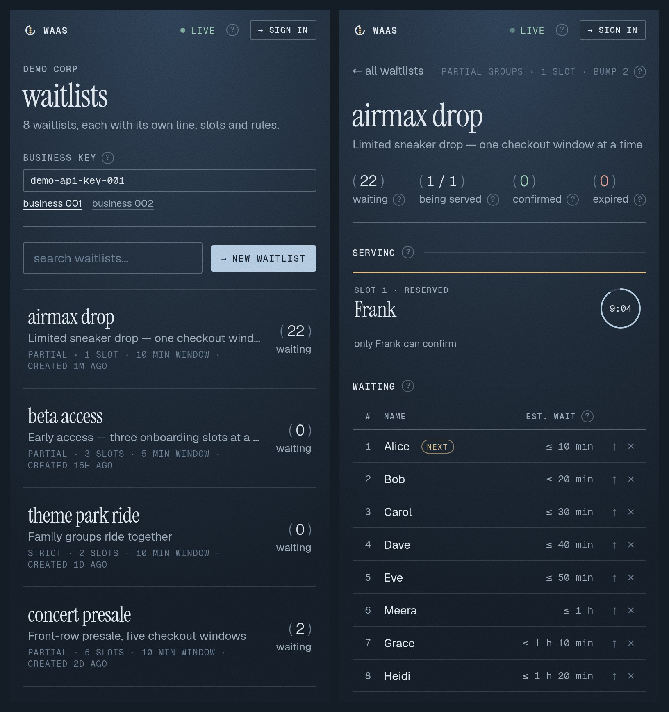</p>

### A business plugging it in

`shop.html` is a pretend shop built from only the integration snippet: get a token, join, then listen for your position. Left to right: waiting in line, your turn with a countdown, and bought.

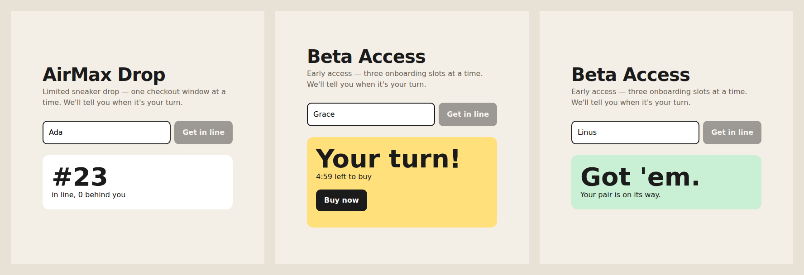

## How it works

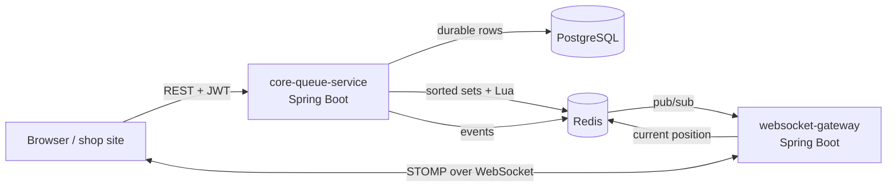

What happens when someone joins:

1. The request passes the JWT check, the rate limit and the idempotency filter.
2. Postgres gets the entry row. `join_sequence` comes from a sequence, and that number is the starting score.
3. `ZADD` puts the entry into the waitlist's sorted set. Any banked referral credits are applied.
4. `promote.lua` moves people into free slots, if there are any.
5. An event goes out on the waitlist's Redis channel. Each gateway marks the waitlist dirty and, on its next 500 ms tick, pushes fresh positions to the clients it holds.

Redis is the fast, live copy; Postgres is the record. If Redis is wiped, a rebuild on startup replays Postgres back into the sorted sets, and a reconciler job fixes drift in both directions while running.

## Numbers

Load test with k6 on a laptop running Docker Desktop (`load/join-burst.js`): 500 users join the same waitlist at once, then a steady stream of 50 joins per second for 60 s.

| | p50 | p95 | p99 |
|---|---|---|---|
| Burst: 500 simultaneous joins (all done in 0.4 s) | 46 ms | 179 ms | 336 ms |
| Steady: 50 joins/s | | 13 ms | |
| Position reads | | 12 ms | |

0 errors in 10,813 requests. The first run had a burst p99 of 445 ms. Cutting database round trips per join got it to 336 ms (more on that below).

**Concurrency proof** (`ConcurrencyProofTest`): 100 people waiting, 3 free slots, 200 threads released at the same moment. The naive version (read how many slots are free, then take one) is asserted to hand out more than 3 slots. `promote.lua` hands out exactly 3, to the first three in line, every time. With raw `redis-cli` the same experiment gave 60 reservations for 3 slots.

## Honest findings

Things I learned by measuring, or by being wrong first:

- **A bigger connection pool made it slower.** The first k6 run spent its time waiting for database connections, so I raised the Hikari pool from 20 to 50. The burst got worse (p99 445 ms to 764 ms). The machine was CPU bound, and 50 queries fighting over a few cores are slower than 20 queries and a short wait in the app. The pool went back to 20. What actually helped was doing fewer queries per join: caching waitlist config for 5 s and letting the foreign key check the user instead of a separate lookup.
- **Check-then-act really does break.** It's easy to say "use a Lua script for atomicity"; it's more convincing to watch the naive version hand out 60 slots out of 3. That test is in CI now.
- **My first write order was impossible.** The design said "add to Redis first, then Postgres". But the queue score comes from a Postgres sequence, so it doesn't exist until the insert. The order is now Postgres first, and a failed Redis write is repaired by the reconciler.
- **Hash sharding a queue breaks its order.** The obvious fix for one huge waitlist is to split its sorted set across hash buckets, but then nobody's global position can be computed. Splitting by score range keeps the order (the architecture doc has the details). I documented this rather than building it.
- **The first waitlist list endpoint leaked.** `GET /api/waitlists` returned every business's waitlists to anyone. It now requires the business's key, pages, and only returns that business's waitlists.
- **Slots don't fit every waitlist.** For a sneaker drop, a slot is a checkout window. For a game's early access it's closer to "invites sent but not yet claimed". A real studio would more likely let in N people per day, which is a rate-based rollout this service doesn't do.
- **The wait estimate is honest about what it doesn't know.** Until a few people have finished their turn, it shows a worst case (`≤ 20 min`, as if everyone uses their whole window), then switches to a measured `~ 8 min`.

## What's still missing

Compared to something you'd run in production:

- **The gateway doesn't check a JWT on connect.** Anyone who knows an entry id can watch that entry's position. Positions aren't very sensitive, but it should still be closed.
- **No CORS setup.** The example shop works because it's served from the same origin. A shop on its own domain would need Core and the gateway to allow that domain.
- **Businesses paste an API key** instead of logging in, and there's no key rotation.
- **One gateway instance.** The design is stateless and meant to scale out behind a load balancer, but I haven't load tested more than one.
- **Pub/sub drops events if the gateway is down.** Clients resync on reconnect, so they end up correct, but Redis Streams or Kafka would be the upgrade if missed events ever mattered.
- **Designed, not built:** an admission queue in front of joins for extreme spikes, Redis Cluster, Postgres read replicas, metrics and tracing dashboards, deleting or archiving waitlists, rate-based rollouts.
- **Not deployed.** It runs locally with Docker Compose.

## Running it locally

You only need Docker. Everything builds inside containers, so no local Java, Maven or Node is required.

```bash
docker compose up --build
```

| What | Where |
|---|---|
| Dashboard | http://localhost:3000 |
| Example shop page | http://localhost:3000/shop.html |
| Core health | http://localhost:8080/actuator/health |
| Gateway health / fan-out stats | http://localhost:8081/actuator/health · http://localhost:8081/stats |

Demo business keys: `demo-api-key-001` (Demo Corp) and `demo-api-key-002` (Nimbus Games). Reset all data with `docker compose down -v`.

Some things to try:

1. Open **AirMax Drop**, sign in as a guest and press **Join as ...**. You'll see yourself in the line.
2. In **console**, press **+50** and watch the line fill, or **Spam 30 requests** to hit the rate limiter.
3. Set the checkout window to **15 s** and watch slots expire and the next person move in.
4. Press **↑** on someone to have a new friend join through their link, and see them jump.
5. Open the shop page in a few tabs with different names, then confirm or release slots on the dashboard.

### Development without Docker for the apps

```bash
docker compose up -d postgres redis
cd core-queue-service && mvn spring-boot:run -Dspring-boot.run.profiles=demo
cd websocket-gateway  && mvn spring-boot:run
cd frontend           && npm install && npm run dev    # http://localhost:5173
```

### Tests

Tests use Testcontainers, so Docker must be running: `mvn test` in either service. Without a local JDK:

```powershell
docker run --rm -v "${PWD}/core-queue-service:/src" -w /src -v //var/run/docker.sock:/var/run/docker.sock -e TESTCONTAINERS_HOST_OVERRIDE=host.docker.internal maven:3.9-eclipse-temurin-21 mvn -B test
```

### Load test

With the stack running (PowerShell, from the repo root):

```powershell
docker run --rm -i --network waas_default -e K6_NO_USAGE_REPORT=true -v "${PWD}/load:/scripts" `
  -e BASE_URL=http://core-queue-service:8080 `
  -e K6_WEB_DASHBOARD=true -e K6_WEB_DASHBOARD_EXPORT=/scripts/report.html `
  grafana/k6 run /scripts/join-burst.js
```

Then open `load/report.html` for the latency graphs.

## Reference

### Project layout

| Path | What |
|---|---|
| `core-queue-service/` | Spring Boot modular monolith: queue, reservation, referral, group, tenant, auth, admission |
| `core-queue-service/src/main/resources/redis/` | The Lua scripts (join, promote, bump, confirm, expire, snapshot, rebuild) |
| `core-queue-service/src/main/resources/db/` | Flyway migrations and the demo seed (`demo` profile only) |
| `websocket-gateway/` | Spring Boot STOMP gateway: holds sockets, fans out Redis events |
| `frontend/` | React + Vite + TypeScript dashboard, served by nginx in compose |
| `load/` | k6 load test |
| `brand/` | Logo and icons |
| `ARCHITECTURE.md` | Design decisions, review findings and the build log |

### API

Users send `Authorization: Bearer <token>` (from `/api/auth/guest`, `/register` or `/login`). Business calls send `X-Api-Key`.

| Method | Path | |
|---|---|---|
| `POST` | `/api/auth/guest` · `/register` · `/login` | get a token |
| `GET` | `/api/waitlists?q=&page=&size=` | the business's waitlists, with live counts (key) |
| `POST` | `/api/waitlists` | create a waitlist (key) |
| `GET` | `/api/waitlists/{id}` | one waitlist's public config |
| `PATCH` | `/api/waitlists/{id}` | change slots or checkout window (key, owner only) |
| `POST` | `/api/waitlists/{id}/entries?ref={userId}` | join, optionally through a referral link |
| `GET` | `/api/waitlists/{id}/entries/{entryId}` | state, position, countdown |
| `DELETE` | `/api/waitlists/{id}/entries/{entryId}` | leave the line |
| `POST` | `/api/waitlists/{id}/entries/{entryId}/confirm` | the slot holder confirms |
| `POST` | `/api/waitlists/{id}/entries/{entryId}/decline` | the slot holder releases it |
| `GET` | `/api/waitlists/{id}/queue` | dashboard snapshot |
| `GET` | `/api/waitlists/{id}/users/{userId}/credits` | referral credit ledger |
| `GET` | `/api/waitlists/{id}/referrals` | recent referrals, credited and blocked |
| `POST` | `/api/waitlists/{id}/groups` | join as a group |
| `POST` | `/api/waitlists/{id}/groups/{groupId}/confirm` | a STRICT group member confirms |

### Live updates (STOMP at `/ws`)

| Subscribe to | You get |
|---|---|
| `/topic/waitlists/{id}/queue` | the queue snapshot, whenever it changes |
| `/topic/waitlists/{id}/entries/{entryId}` | one entry's state, position and countdown |
| `/app/...` (same paths) | the current state, once, right away |
